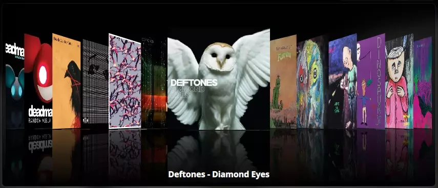

# mtoc - Visual Music Library

mtoc (music table of contents) is a visually-rich music player and library browser for Linux that emphasizes smooth, continuous browsing experiences with album artwork at the forefront. 


## Getting Started

### Flatpak Installation (Flathub)

```bash
flatpak install flathub org._3fz.mtoc
```

#### RPM Package Installation (Fedora 42+)

```bash
# Add the copr repository:
sudo dnf copr enable 3fz-asa/mtoc

# Install:
sudo dnf install mtoc
```

# Features

### Album Browsing
Album browsing is core to the experience. mtoc is made for the music fan who likes to flip through CDs or records and look at the pictures before deciding what to listen to. The album carousel interface presents your album covers on a slick reflective shelf, with responsive, satisfying animations as you flip through them in a linear fashion. Mouse wheel, click + drag, and touchpad are all supported, with direct content manipulation for a smooth touchpad experience. 



### Layout and Navigation
mtoc features two layout options: wide mode uses a "bento box" layout that places the album art, playback and queue in the largest section, with the carousel, artists/playlists column, and tracklist column on the left. Compact mode hides the right pane, placing the playback controls at the bottom and the queue and full-size album art in popups. 

The artists list features album artists sorted alphabetically. An artist can be expanded to reveal their albums, represented in a thumbnail grid, and sorted by year. The tracklist for the current album selection occupies the right column. Continuous navigation is enabled between interface elements by links that animate scrolling to and revealing the selection in its relevant list. 

Keyboard navigation is featured in all lists, jumping between lists, and for search. You can perform the essential functions of searching for and playing music without lifting a hand. 

### Library Features
- Responsive search function finds artists, albums, and tracks, jumping to and selecting the relevant item in the list
- File watcher and automatic library updates show your newly added music in mtoc with no manual action required

### Library Management
The library editor lets you select one or multiple directories to scan for music, and optionally specify additional directories for .m3u playlist files. 
- Supported formats: MP3, MP4/M4A (including iTunes-encoded AAC and ALAC), FLAC, OGG Vorbis, Opus
- Metadata extraction using TagLib 2.0
- Embedded album artwork extraction
- SQLite database for fast library access

### Mini Player
The mini player places essential playback controls in a separate small window. It can be configured to either hide the main window upon showing the mini player, or to keep both visible.

There are three mini player layouts: vertical, horizontal, and compact. All feature the same functionality, offered in different sizes and shapes to suit your display dimensions and preference. 

Note that the mini player will attempt to keep itself above other windows. This works when the application is running in an X11 environment or using XWayland. Wayland does not currently support applications keeping their own window on top. To make it work this way on Wayland, you will have to use the window management features that come with your desktop environment. 

### Queueing features
Tracks, albums, and playlists can be enqueued from the library, either added up next, or appended to the end of the queue, through the right-click context menu. Multi-selection of tracks for queueing is supported. The queue supports modification: delete, multi-select and delete, reorder through drag-and-drop. 

### Playlists
Playlist creation in mtoc starts out with creating a queue. When you have a queue that you like, the save button writes its contents to a new .m3u playlist in your default playlist directory. The playlist editor can be used to add, remove, and reorder tracks in playlists. 

The provided All Songs virtual playlist is automatically updated and can be used to play your entire library sequentially or on shuffle. 

### Playback Modes
mtoc features shuffle and repeat modes. Shuffle uses a modified Fisher-Yates algorithm that incorporates newly enqueued tracks as you go. 

### Playback Features
- GStreamer-based audio engine
- Gapless audio support for seamless album listening
- ReplayGain support for volume normalization on tracks with the ReplayGain tag set, supporting either per-album or per-track modes
- Fallback gain allows you to set a default gain for tracks that don't feature the ReplayGain tag, keeping your hearing safe when listening to a library with mixed ReplayGain tags

### Lyrics Support
mtoc provides comprehensive lyrics display for your music collection:
- **Synchronized Lyrics**: Full support for LRC format with real-time highlighting that follows playback position
- **Embedded and External**: Supports both embedded lyrics in audio metadata and external lyric files
- **Automatic Detection**: Lyrics files are automatically detected and loaded from your track directories during library scanning, with fuzzy matching that pairs lyrics with the relevant track
- **Integrated Display**: View lyrics in the now playing pane for the wide layout or a dedicated popup for the compact layout
- **Multiple Formats**: Supports both .lrc (timestamped) and .txt (plain text) file formats

### State Persistence
mtoc saves your position in the interface as well as playback state including your queue, current track, playback position, carousel position, and window positions (including mini player), so that you can pick up where you left off after restarting the app.

### Desktop Integration
- **MPRIS 2**: Full support for media keys and system controls, integrating seamlessly with your desktop environment's media controls
- **System Tray**: Background operation with system tray icon, allowing you to minimize to tray and control playback from the tray menu

### High Performance
Performance is a core design principle. mtoc aims for visual appeal and continuity in browsing.
- Hardware-accelerated rendering
- Event-driven MVC architecture fine-tuned for efficiency
- **Dynamic Cache Management**: Adaptive image cache sizing based on available system memory (5-10% of RAM, 128MB-1GB range) that automatically adjusts based on thumbnail scale settings
- Asynchronous metadata extraction and image loading
- Virtual playlist architecture for efficient handling of large playlists (thousands of tracks)
- Optimized for smooth scrolling and searching even with thousands of albums
#### Implementation Guidelines
Frequent reads and minimal writes makes this an application that benefits from extensive caching at the controller and view layers.
- Cache data generously to reduce disk access frequency
- Lazy loading and buffering strategies for large datasets

### System Requirements
- Linux with X11/Wayland
- OpenGL/GPU acceleration recommended
- Solid state storage recommended
- 4GB system RAM recommended. Typical usage for mtoc remains under ~350MB, but may be higher when scanning the library or skipping through large amounts of tracks. 

#### Dependencies
- Qt6 >= 6.9 (Core, Quick, Qml, Multimedia, DBus, Concurrent, Widgets, Sql)
- CMake >= 3.16
- TagLib >= 2.0
- GStreamer >= 1.0
- pkg-config
- C++17 compatible compiler

#### Build From Source

```bash
# Install dependencies

# Ubuntu/Debian:
sudo apt install qt6-base-dev qt6-multimedia-dev qt6-declarative-dev \
                 libtag1-dev libgstreamer1.0-dev pkg-config cmake

# Fedora:
sudo dnf install qt6-qtbase-devel qt6-qtmultimedia-devel qt6-qtdeclarative-devel \
                 taglib-devel gstreamer1-devel pkgconfig cmake gcc-c++

# Arch Linux:
sudo pacman -S qt6-base qt6-multimedia qt6-declarative qt6-svg qt6-tools \
               taglib gstreamer cmake pkgconf base-devel

# Clone the repository
git clone https://github.com/asa-degroff/mtoc.git
cd mtoc

# Create build directory
mkdir build && cd build

# Configure
cmake ..

# Build
cmake --build .

# Run locally (without installation)
./mtoc_app

# Or install system-wide (optional)
sudo cmake --build . --target install
mtoc_app  # Now available in system PATH
```

## Usage

### First Run
On first launch, mtoc will feature an empty library. Click "Edit Library" (or the link provided in the placeholder) and add the folder containing your music. The default folder is ~/Music. You can add or remove any directories you want to scan. Press scan, and mtoc will then scan and index your music collection, extracting metadata and album artwork.

### Usage Tips
- mtoc works best with well-tagged music libraries. At a minimum, all tracks should have a title, artist, and album artist to be properly displayed and sorted. 
- mtoc may not suit libraries that contain a lot of singles. Tracks are grouped by album, and libraries with a high track:album ratio may make the interface feel cluttered. 

## Architecture

- **Backend (C++)**
  - `LibraryManager`: Music collection scanning and organization with lyrics support
  - `DatabaseManager`: SQLite persistence layer
  - `MediaPlayer`: Playback control and queue management
  - `AudioEngine`: GStreamer integration with gapless playback and ReplayGain
  - `MetadataExtractor`: TagLib wrapper for file analysis
  - `AlbumArtManager`: Intelligent album art caching
  - `PlaylistManager`: M3U playlist management and virtual playlists
  - `SettingsManager`: Application configuration and preferences
  - `MprisManager`: Linux desktop integration via MPRIS2
  - `SystemInfo`: Application metadata provider

- **Frontend (QML)**
  - Main window with Library and Now Playing panes
  - Mini player with multiple layout modes (vertical, horizontal, compact)
  - Horizontal album carousel browser
  - Lyrics display (synchronized and plain text)
  - Queue management with drag-and-drop
  - Responsive search bar
  - Responsive playback controls
  - Custom UI animations and styled components
  - Hardware-accelerated rendering
  - Responsive two-pane layout
  - Theme system for consistent styling

  See [ARCHITECTURE.md](/ARCHITECTURE.md) for details. 

## License

This project is licensed under the GPL v3 License - see the LICENSE file for details.

## Acknowledgments

- Built with [Qt](https://www.qt.io/) and [QML](https://doc.qt.io/qt-6/qmlapplications.html)
- Audio metadata extraction powered by [TagLib](https://taglib.org/)
- Audio playback powered by [GStreamer](https://gstreamer.freedesktop.org/)

## Contact

Project Link: [https://github.com/asa-degroff/mtoc](https://github.com/asa-degroff/mtoc)

Official Website: [mtoc.3fz.org](https://mtoc.3fz.org)

email: asa@3fz.org
